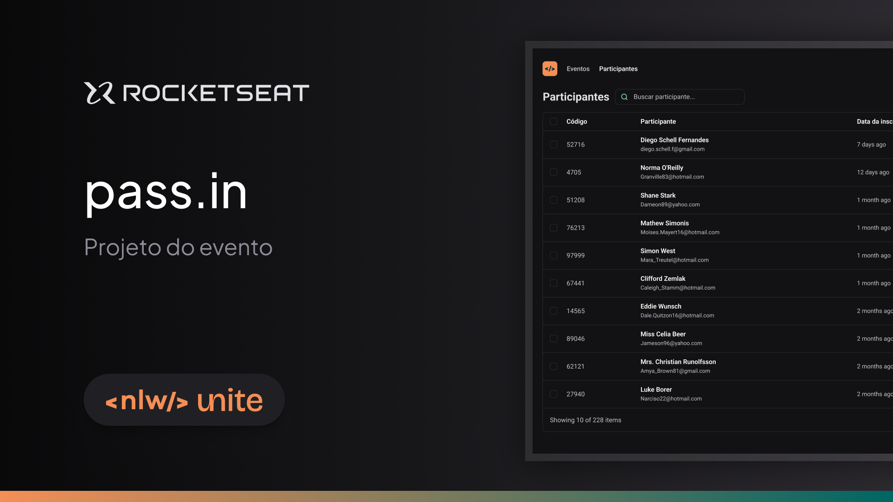

# Dashboard

Este projeto é um [**Dashboard**](https://nlw-unite-one.vercel.app/) simples construído usando ReactJS com TypeScript (tsx) e ViteJS, estilizado com Tailwind CSS. O dashboard exibe dados de usuários em formato de tabela e inclui um recurso de pesquisa para filtrar usuários por nome ou e-mail.

## Tecnologias Utilizadas

- ReactJS (para construção da interface do usuário)
- TailwindCSS (para estilização e layout responsivo)
- ViteJS (para desenvolvimento rápido)
- TypeScript (para tipagem estática)

## Link para o Site

